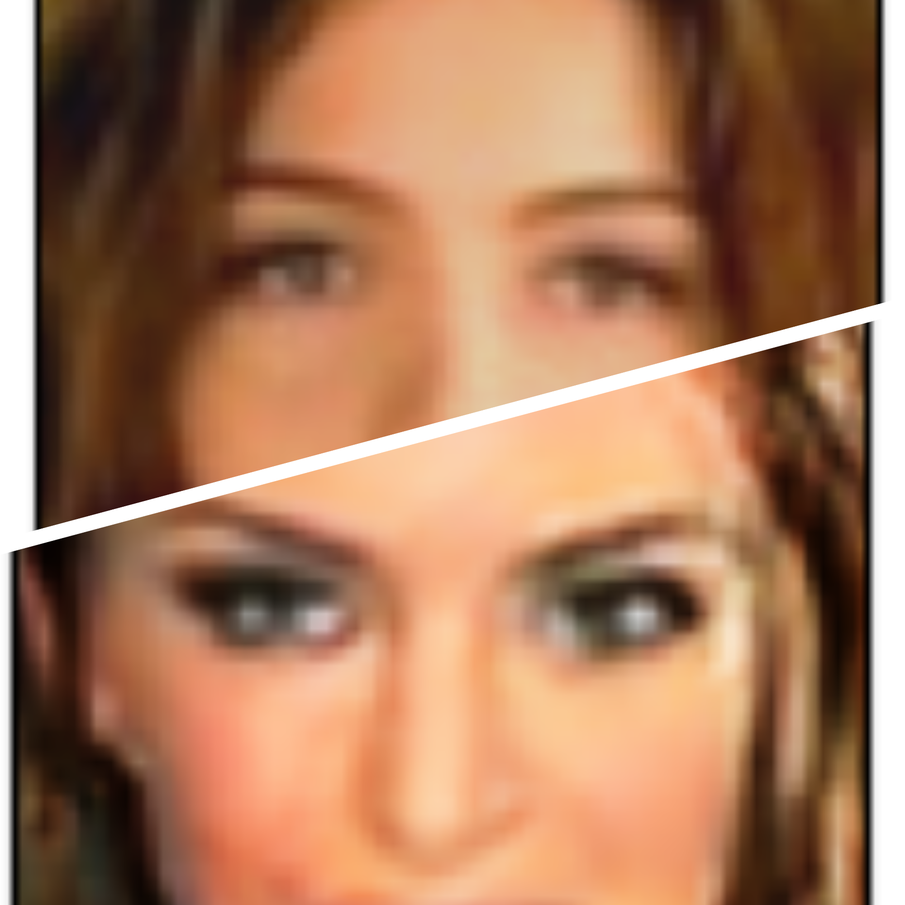
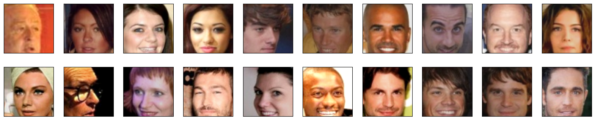
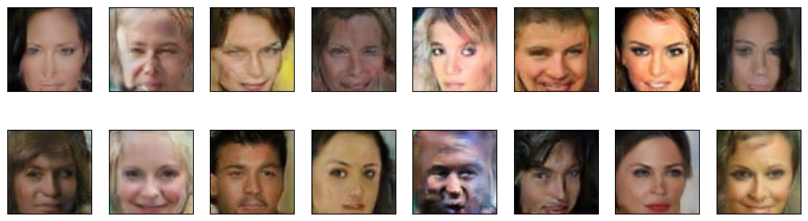

# WGAN-GP for Face Generation


This project uses the Wasserstein Generative Adversarial Network with Gradient Penalty (WGAN-GP) to generate realistic face images.


## Overview

The main goal of this project is to define and train a Generative Adversarial Network (GAN) to generate new, realistic images of faces. The GAN training process involves an adversarial game between the Generator and Discriminator. This project utilizes the WGAN-GP, which addresses mode collapse and training instability issues present in traditional GANs.
<p align="center">
  
</p>

## Dataset

The training data is derived from the [CelebFaces Attributes Dataset (CelebA)](http://mmlab.ie.cuhk.edu.hk/projects/CelebA.html). This dataset consists of higher resolution images of celebrity faces. Note: Training on this high-resolution data might require a significant amount of time, so it's recommended to use a GPU.

### Pre-processed Data

The CelebA images have been pre-processed to only focus on the face by cropping and then resizing them to 64x64x3. Sample processed data can be seen [here](assets/processed_face_data.png).

If you're setting up locally, you can download the pre-processed data [here](https://s3.amazonaws.com/video.udacity-data.com/topher/2018/November/5be7eb6f_processed-celeba-small/processed-celeba-small.zip). Once downloaded, extract the content in the project directory to get the `processed-celeba-small/` folder.

## Network Architecture

## Generator Architecture Overview

The Generator's primary role in the WGAN-GP is to produce synthetic images using sophisticated deep learning techniques.

### Key Features:

1. **Spectral Normalization**: Applied to convolutional layers, ensuring stable training and preventing mode collapse.
2. **Residual Blocks**: Preserve gradient information during backpropagation and alleviate the vanishing gradient issue.
3. **Up-sampling Blocks**: Enlarge the spatial dimensions of the feature maps, with each block consisting of an Upsampling layer, Convolution, Instance Normalization, ReLU activation, and a Residual Block.
4. **Fully Connected Layer**: Converts the latent vector into a seed for the up-sampling blocks.
5. **Tanh Activation**: Constrains the final image pixel values between -1 and 1.

### Forward Mechanism:

The forward pass:
1. Begins with transforming the latent vector via the fully connected layer.
2. Processes the resultant feature map through a sequence of up-sampling blocks.
3. Outputs an image with pixel values normalized between -1 and 1.


## Discriminator Architecture Summary

The Discriminator in the WGAN-GP setup is tasked with distinguishing between real and generated images.

### Key Features:

1. **Residual Blocks**:
   - Enhance the flow of gradients and prevent loss of feature details.
   - Comprise convolutional layers, instance normalization, and LeakyReLU activation.

2. **Convolutional Layers**:
   - Extract hierarchical features from input images.
   - Employed multiple times to gradually reduce image dimensions and intensify feature abstraction.

3. **Fully Connected Layer**:
   - Outputs a scalar value, representing the authenticity score of the provided image.

During the forward pass, the image progresses through a series of convolutional layers, interspersed with residual blocks, and culminates in a scalar authenticity score produced by the fully connected layer.


## Loss Functions and Gradient Penalty

Both the generator and discriminator use their own loss functions, which together determine the dynamics of the adversarial game. The WGAN-GP also introduces a gradient penalty term, ensuring the discriminator's gradients have a norm close to one, enhancing the training stability.

1. **Generator Loss (generator_loss)**:
    - Accepts the fake scores (logits) produced by the discriminator.
    - Aims to maximize the discriminator's error on the synthetic images.

2. **Discriminator Loss (discriminator_loss)**:
    - Accepts both real and fake scores (logits).
    - Measures the difference between the mean scores for fake and real images. The objective is to maximize the score for real images and minimize for fake ones.

3. **Gradient Penalty (gradient_penalty)**:
    - Ensures the 1-Lipschitz constraint for the discriminator, aiding stable and robust training.
    - Calculates the penalty based on the gradients of the discriminator's scores with respect to linearly interpolated samples between real and fake images.
    - Penalizes deviations of the gradient norms from 1.

These loss functions and gradient penalty work in tandem to stabilize and improve the training of the WGAN-GP.

## How to Train

Training the WGAN-GP model is facilitated through the `face-gen.ipynb` Jupyter notebook. Here's a step-by-step guide to help you through the process:

1. **Environment Setup**:
    - Ensure you have Jupyter Notebook or Jupyter Lab installed. If not, you can install it using pip:
    ```bash
    pip install jupyterlab
    ```

2. **Clone the Repository**:
    ```bash
    git clone [[Your Repository URL]](https://github.com/naoufal51/FaceGen.git)
    cd FaceGen
    ```

3. **Install Dependencies**:
    Ensure you have all the necessary dependencies installed. You can usually do this by running:
    ```bash
    pip install -r requirements.txt
    ```
    > Note: If you don't have a `requirements.txt`, you should list the dependencies manually in the README (like PyTorch, torchvision, etc.), and the user has to install them individually.

4. **Launch Jupyter Lab/Notebook**:
    ```bash
    jupyter lab
    ```
    or
    ```bash
    jupyter notebook
    ```
    This command will open a new tab in your web browser with the Jupyter interface.

5. **Open the Notebook**:
    Navigate to the `face-gen.ipynb` notebook within the Jupyter interface and open it.

6. **Download the Dataset**:
    - If you haven't already, download the pre-processed CelebA dataset from the [provided link](https://s3.amazonaws.com/video.udacity-data.com/topher/2018/November/5be7eb6f_processed-celeba-small/processed-celeba-small.zip) and extract it into the project directory.

7. **Run the Training Cells**:
    - Start by running the initial cells which set up the dataset, the neural network models, and utility functions.
    - Then, run the cells under the training section. Ensure you have a GPU if you want faster training times. You can monitor the loss values and any other metrics you've set up to ensure the training is proceeding as expected.

8. **Monitor Results**:
    After training, you can use the cells at the end of the notebook to visualize the generated faces and evaluate the performance of your model.


## Results

At the end of the training process, the generator should produce realistic face images with minimal noise artifacts. Here's a comparison between real faces from the dataset and generated faces by our trained model:

**Real Faces from Dataset**:


**Generated Faces by WGAN-GP**:


Visualizations and example images will be provided to showcase the performance of the trained GAN.

## Dependencies

- PyTorch
- torchvision
- NumPy
- matplotlib

---
## Acknowledgements
- [Udacity](https://udacity.com/) for providing the dataset and starter code.
